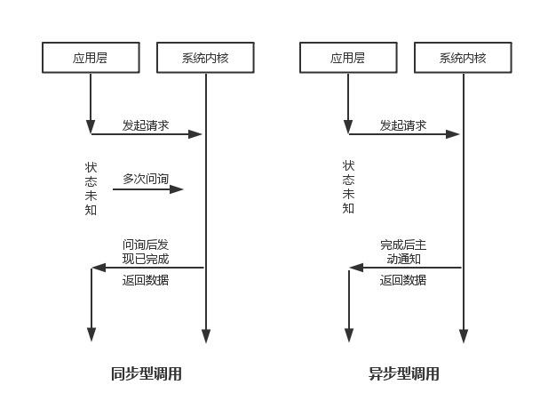
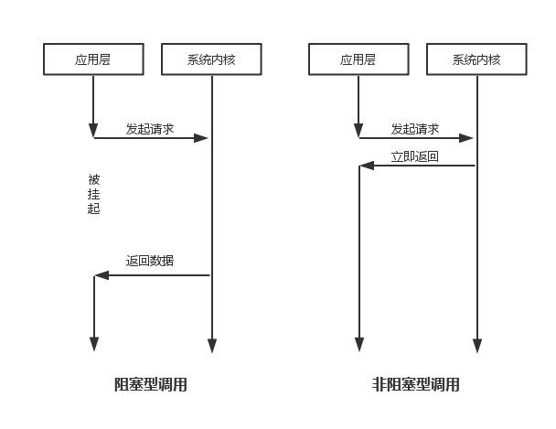

本篇文章其实是讲编程全领域通行的概念，之所以单独拎出来写在本书，是因为笔者发现绝大多数前端工程师对这块儿的概念理解得不太严谨。

在实际的开发中，我们经常会听到同步、异步，阻塞、非阻塞这些编程概念，可能都会比较懵，然后就各种查网上似是而非的资料，结果越查越迷糊，大部分文章都千篇一律，没有说到本质上的区别。所以下次再碰到这些概念，印象还是比较模糊，尤其是在一些场景下同步与阻塞，异步与非阻塞感觉没什么区别，但其实这四个术语描述的事物还真不是一回事。

下面我们来慢慢探讨他们之间的区别与联系，在这之前，我们还会经常看到下面的组合术语：

* 同步+阻塞
* 同步+非阻塞
* 异步+阻塞
* 异步+非阻塞

在当什么是同步和异步，阻塞与非阻塞的概念还没弄清楚之前，更别提上面这些组合术语了，只会让你更加困惑。

## 10.1 同步和异步

**同步和异步其实指的是，请求发起方对消息结果的获取是主动发起的，还是等被动通知的。**

如果是请求方主动发起的，一直在等待应答结果（同步阻塞），或者可以先去处理其他的事情，但要不断轮询查看发起的请求是否有应答结果（同步非阻塞 ）因为不管如何都要发起方主动获取消息结果，所以形式上还是同步操作。

如果是由服务方通知的，也就是请求方发出请求后，要么在一直等待通知（异步阻塞），要么就先去干自己的事了（异步非阻塞），当事情处理完成之后，服务方会主动通知请求方，它的请求已经完成，这就是异步。异步通知的方式一般是通过状态改变，消息通知，或者回调函数来完成，大多数时候采用的都是回调函数。

## 10.2 阻塞和非阻塞

阻塞和非阻塞在计算机的世界里面，通常指的是针对IO的操作，如网络IO和磁盘IO等。

那么什么是阻塞和非阻塞呢？简单的说就是我们调用了一个函数之后，在等待这个函数返回结果之前，当前的线程是处于挂起状态，还是运行状态，如果是挂起状态，就意味着当前线程什么都不能干，就等着获取结果，这就叫同步阻塞，如果仍然是运行状态，就意味当前线程是可以的继续处理其他任务，但要时不时的去看下是否有结果了，这就是同步非阻塞。

## 10.3 场景举例

同步，异步，阻塞和非阻塞，会组合成上面提到过的四种结果：

举个例子，比如我们去照相馆拍照，拍完照片之后，商家说需要30分钟左右才能洗出来照片。

### 1. 同步+阻塞

这个时候如果我们一直在店里面啥都不干，一直等待商家面前等待它洗完照片，这个过程就叫同步阻塞。

### 2. 同步+非阻塞

当然大部分人很少这么干，更多的是大家拿起手机开始看电视，看一会就会问老板洗完没，老板说没洗完，然后我们接着看，再过一会接着问，直到照片洗完，这个过程就叫同步非阻塞。

### 3. 异步+阻塞

因为店里生意太好了，越来越多的人过来拍，店里面快没地方坐了，老板说你把你手机号留下，我一会洗好了就打电话告诉你过来取，然后你去外面找了一个长凳开始躺着睡觉等待老板打电话，啥不都干，这个过程就叫异步阻塞。

### 4.异步+非阻塞

当然实际情况是，大家可能会直接先去逛街或者吃饭做其他的活动，店老板来了电话就去取照片，这样一来两不耽误，这个过程就叫异步非阻塞。

## 壹.2.7.4 小结

只有严谨地理解了同步、异步，阻塞、非阻塞的概念，才能更好地理解JavaScript的事件处理机制以及Eventloop，我们下一篇见。

