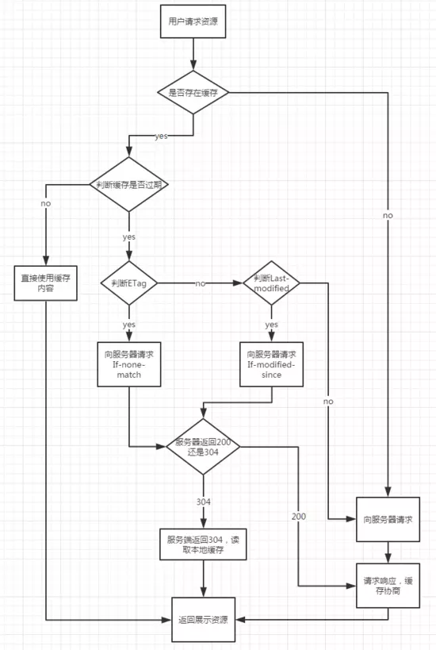

## 1. 浏览器缓存机制

缓存是性能优化中非常重要的一环，浏览器的缓存机制对开发也是非常重要的知识点。浏览器总体缓存处理流程如下所示：



简单来说，浏览器缓存其实就是浏览器保存通过 HTTP 获取的所有资源，是浏览器将网络资源存储在本地的一种行为。

## 1.1 强缓存

利用请求头中的 Cache-Control 以及 Expires，二者作用一致，都是指明当前资源的有效期，控制浏览器是直接从浏览器缓存中拿数据还是重新发送请求到服务器。

如果两者同时设置的话，**Cache-Control 优先级要高于 Expires。**

二者区别：

（1）**Expires**：（HTTP1.0）请求头上的 Expires 与服务器间的时间是绝对时间，如果客户端修改了时间，就会影响缓存命中的效果。

（2）**Cache-Control**：（HTTP1.1）Cache-control 与 Expires 不同的点在于它并没有具体的某一个过期时间点的方式，而是采用过期时长来控制缓存，对应的字段是**max-age**。比如这个例子:

```http
Cache-Control:max-age=3600
```

此外，max-age 可以组合非常多的指令，完成更多场景的缓存判断：

- **no-cache**：需要进行协商缓存，发送请求到服务器确认是否使用缓存。

- **no-store**：禁止使用缓存。
- **public**：可以被所有的用户缓存，包括终端用户和 CDN 等中间代理服务器。
- **private**：只能被终端用户的浏览器缓存，不允许 CDN 等中继缓存服务器对其缓存。
- **s-maxage**：这和`max-age`长得比较像，但是区别在于 s-maxage 是针对代理服务器的缓存时间。

还存在一种情况，当资源缓存时间超时了，也就是强缓存失效了，那么就会进入下一阶段：**协商缓存。**

## 1.2 协商缓存

当强缓存没有命中的时候，浏览器就会发送一个请求到服务器，服务器根据 Header 中的部分信息来判断是否命中缓存。如果命中，则返回 304，告诉浏览器资源未更新，可使用本地缓存。这里的 header 中的信息指的是 Last-Modify/If-Modify-Since 和 ETag/If-None-Match。

**Last-Modify**：在浏览器第一次给服务器发送请求后，服务器会在响应头上加上这个字段。浏览器接收到后，再次请求，会在请求头中携带`If-Modified-Since`字段，这个字段的值也就是服务器传来的最后修改时间。服务器拿到请求头中的`If-Modified-Since`的字段后，会和这个服务器中该资源的最后修改时间进行对比：

- 如果请求头中的这个值小于最后修改时间，说明资源需要更新，返回新的资源。
- 否则返回 304，告诉浏览器直接用缓存。

**ETag：**`ETag`是服务器根据当前文件的内容，给文件生成的唯一标识，主要里面的内容有改动，这个值就会发生变化。服务器通过`响应头`把这个值给浏览器。浏览器接收到`ETag`的值，会在下次请求时，将这个值作为`If-None-Match`这个字段的内容，并放到请求头中，然后发给服务器。

服务器在接收到`If-None-Match`后，会跟服务器上该资源的**ETag**进行比对:

- 如果两者不一样，说明要更新了。返回新的资源，跟常规的 HTTP 请求响应的流程一样。
- 否则返回 304，告诉浏览器直接用缓存。

**二者对比：**

（1）在`精准度`上，`ETag`优于`Last-Modified`。由于`ETag` 是按照内容给资源上标识，因此能准确感知资源的变化。而 Last-Modified 就不一样了，它在一些特殊的情况并不能准确感知资源变化，主要有两种情况:

- 编辑了资源文件，但是文件内容并没有更改，这样也会造成缓存失效。
- Last-Modified 能够感知的单位时间是秒，如果文件在 1 秒内改变了多次，那么这时候的 Last-Modified 并不会体现出文件修改了。

（2）在性能上，`Last-Modified`优于`ETag`，也很简单理解，`Last-Modified`仅仅只是记录一个时间点，而 `Etag`需要根据文件的具体内容生成哈希值。

另外，如果两种方式都支持的话，服务器会优先考虑`ETag`。

## 1.3 缓存位置

前面我们已经提到，当`强缓存`命中或者协商缓存中服务器返回 304 的时候，我们直接从缓存中获取资源。那这些资源究竟缓存在什么位置呢？

浏览器中的缓存位置一共有四种，按优先级从高到低排列分别是：

- Service Worker
- Memory Cache（内存）
- Disk Cache（磁盘）
- Push Cache

**Service Worker**：借鉴了 Web Worker 的 思路，即让 JS 运行在主线程之外，由于它脱离了浏览器的窗体，因此无法直接访问`DOM`。虽然如此，但它仍然能帮助我们完成很多有用的功能，比如`离线缓存`、`消息推送`和`网络代理`等功能。其中的`离线缓存`就是 **Service Worker Cache**，其同时也是 PWA 的重要实现机制。

**Memory Cache**：指的是内存缓存，从效率上讲它是最快的。但是从存活时间来讲又是最短的，当渲染进程结束后，内存缓存也就不存在了。

**Disk Cache**：就是存储在磁盘中的缓存，从存取效率上讲是比内存缓存慢的，但是他的优势在于存储容量和存储时长。

好，现在问题来了，既然两者各有优劣，那浏览器如何决定将资源放进内存还是硬盘呢？主要策略如下：

- 比较大的 JS、CSS 文件会直接被丢进磁盘，反之丢进内存
- 内存使用率比较高的时候，文件优先进入磁盘

**Push Cache**：即推送缓存，这是浏览器缓存的最后一道防线。它是 `HTTP/2` 中的内容，虽然现在应用的并不广泛，但随着 HTTP/2 的推广，它的应用越来越广泛。
