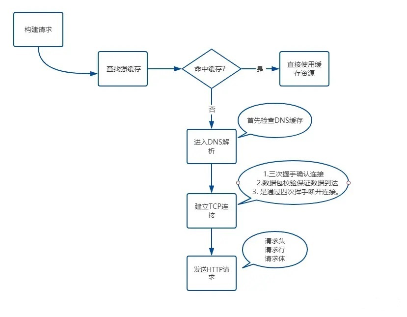
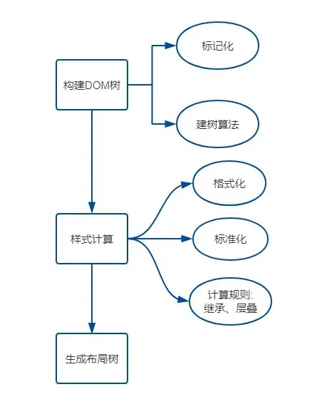
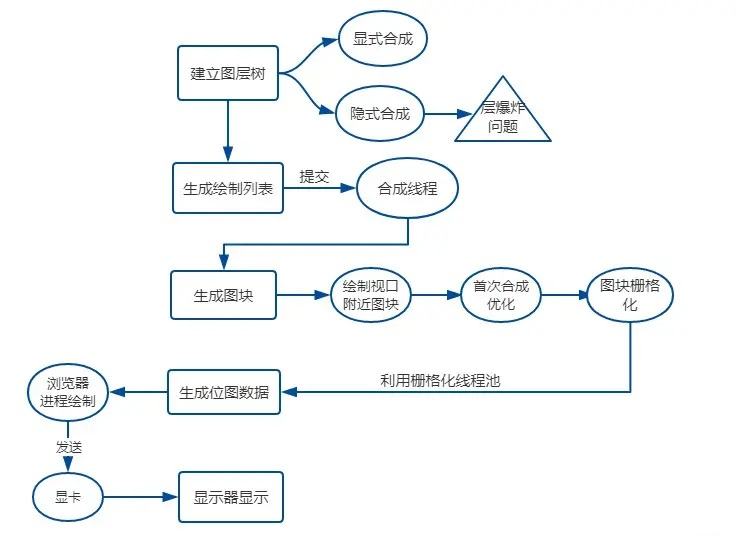

## 3.1 网络请求

在浏览器地址栏输入了百度的网址：

```
https://www.baidu.com/
```

（1）**构建请求**：GET /HTTP/1.1

（2）**查找强缓存**：先检查强缓存，如果命中直接使用，否则进入下一步。

（3）**DNS 解析**：由于我们输入的是域名，而数据包是通过`IP地址`传给对方的。因此我们需要得到域名对应的`IP地址`。这个过程需要依赖一个服务系统，这个系统将域名和 IP 一一映射，我们将这个系统就叫做**DNS**（域名系统）。得到具体 IP 的过程就是`DNS`解析。

当然，值得注意的是，浏览器提供了**DNS 数据缓存功能**。即如果一个域名已经解析过，那会把解析的结果缓存下来，下次处理直接走缓存，不需要经过 `DNS解析`。

另外，如果不指定端口的话，默认采用对应的 IP 的 80 端口。

（4）**建立 TCP 连接**：

这里要提醒一点，Chrome 在同一个域名下要求同时最多只能有 6 个 TCP 连接，超过 6 个的话剩下的请求就得等待。

假设现在不需要等待，我们进入了 TCP 连接的建立阶段。首先解释一下什么是 TCP:

> TCP（Transmission Control Protocol，传输控制协议）是一种面向连接的、可靠的、基于字节流的传输层通信协议。

建立 `TCP连接`经历了下面三个阶段:

1. 通过**三次握手**(即总共发送 3 个数据包确认已经建立连接)建立客户端和服务器之间的连接。
2. 进行数据传输。这里有一个重要的机制，就是接收方接收到数据包后必须要向发送方`确认`, 如果发送方没有接到这个`确认`的消息，就判定为数据包丢失，并重新发送该数据包。当然，发送的过程中还有一个优化策略，就是把`大的数据包拆成一个个小包`，依次传输到接收方，接收方按照这个小包的顺序把它们`组装`成完整数据包。
3. 断开连接的阶段。数据传输完成，现在要断开连接了，通过**四次挥手**来断开连接。

读到这里，你应该明白 TCP 连接通过什么手段来保证数据传输的可靠性，一是`三次握手`确认连接，二是`数据包校验`保证数据到达接收方，三是通过`四次挥手`断开连接。

当然，如果再深入地问，比如**为什么要三次握手，两次不行吗？第三次握手失败了怎么办？为什么要四次挥手**等等这一系列的问题，涉及计算机网络的基础知识，比较底层，但是也是非常重要的细节，希望你能好好研究一下，另外这里有一篇不错的文章，[点击进入相应的推荐文章](https://link.juejin.cn?target=https%3A%2F%2Fzhuanlan.zhihu.com%2Fp%2F86426969)，相信这篇文章能给你启发。

（5）**发送 HTTP 请求**

现在`TCP连接`建立完毕，浏览器可以和服务器开始通信，即开始发送 HTTP 请求。浏览器发 HTTP 请求要携带三样东西:**请求行**、**请求头**和**请求体**。

首先，浏览器会向服务器发送**请求行**,关于**请求行**， 我们在这一部分的第一步就构建完了，贴一下内容:

```js
// 请求方法是GET，路径为根路径，HTTP协议版本为1.1
GET / HTTP / 1.1;
复制代码;
```

结构很简单，由**请求方法**、**请求 URI**和**HTTP 版本协议**组成。

同时也要带上**请求头**，比如我们之前说的**Cache-Control**、**If-Modified-Since**、**If-None-Match**都由可能被放入请求头中作为缓存的标识信息。当然了还有一些其他的属性，列举如下:

```
Accept: text/html,application/xhtml+xml,application/xml;q=0.9,image/webp,image/apng,*/*;q=0.8,application/signed-exchange;v=b3
Accept-Encoding: gzip, deflate, br
Accept-Language: zh-CN,zh;q=0.9
Cache-Control: no-cache
Connection: keep-alive
Cookie: /* 省略cookie信息 */
Host: www.baidu.com
Pragma: no-cache
Upgrade-Insecure-Requests: 1
User-Agent: Mozilla/5.0 (iPhone; CPU iPhone OS 11_0 like Mac OS X) AppleWebKit/604.1.38 (KHTML, like Gecko) Version/11.0 Mobile/15A372 Safari/604.1
复制代码
```

最后是请求体，请求体只有在`POST`方法下存在，常见的场景是**表单提交**。

（6）**网络响应**

HTTP 请求到达服务器，服务器进行对应的处理。最后要把数据传给浏览器，也就是返回网络响应。

跟请求部分类似，网络响应具有三个部分:**响应行**、**响应头**和**响应体**。

响应行类似下面这样:

```js
HTTP/1.1 200 OK
复制代码
```

由`HTTP协议版本`、`状态码`和`状态描述`组成。

响应头包含了服务器及其返回数据的一些信息, 服务器生成数据的时间、返回的数据类型以及对即将写入的 Cookie 信息。

举例如下:

```
Cache-Control: no-cache
Connection: keep-alive
Content-Encoding: gzip
Content-Type: text/html;charset=utf-8
Date: Wed, 04 Dec 2019 12:29:13 GMT
Server: apache
Set-Cookie: rsv_i=f9a0SIItKqzv7kqgAAgphbGyRts3RwTg%2FLyU3Y5Eh5LwyfOOrAsvdezbay0QqkDqFZ0DfQXby4wXKT8Au8O7ZT9UuMsBq2k; path=/; domain=.baidu.com
复制代码
```

响应完成之后怎么办？TCP 连接就断开了吗？

不一定。这时候要判断`Connection`字段, 如果请求头或响应头中包含**Connection: Keep-Alive**，表示建立了持久连接，这样`TCP`连接会一直保持，之后请求统一站点的资源会复用这个连接。

否则断开`TCP`连接, 请求-响应流程结束。

完整的流程图如下所示：



## 3.2 解析请求返回值，生成布局树

完成了网络请求和响应，如果响应头中`Content-Type`的值是`text/html`，那么接下来就是浏览器的`解析`和`渲染`工作了。

首先来介绍**解析**部分，主要分为以下几个步骤:

- 构建 `DOM`树
- 构建`CSSOM`树（样式计算）
- 生成`布局树`(`Layout Tree`)

（1）构建 DOM 树

由于浏览器无法直接理解`HTML字符串`，因此将这一系列的字节流转换为一种有意义并且方便操作的数据结构，这种数据结构就是`DOM树`。`DOM树`本质上是一个以`document`为根节点的多叉树。

（2）样式计算

关于 CSS 样式，它的来源一般是三种:

- **link 标签引用**
- **style 标签中的样式**
- **元素的内嵌 style 属性**

第一步需要**格式化样式表**：浏览器是无法直接识别 CSS 样式文本的，因此渲染引擎接收到 CSS 文本之后第一件事情就是将其转为一个结构化的对象，即 styleSheets。（通过浏览器 document.styleSheets）可以查看这个最终的结构。

第二步需要**标准化样式属性**：有一些 CSS 样式的数值并不容易被渲染引擎所理解，因此需要在计算样式之前将它们标准化，如`em`->`px`,`red`->`#ff0000`,`bold`->`700`等等。

最后通过**继承**和**层叠**的方式生成**CSSOM 树**。

（3）生成布局树

现在已经生成了`DOM树`和`DOM样式`，接下来要做的就是通过浏览器的布局系统`确定元素的位置`，也就是要生成一棵`布局树`(Layout Tree)。

布局树生成的大致工作如下:

1. 遍历生成的 DOM 树节点，并把他们添加到`布局树中`。
2. 计算布局树节点的坐标位置。

值得注意的是，这棵布局树值包含可见元素，对于 `head`标签和设置了`display: none`的元素，将不会被放入其中。

有人说首先会生成`Render Tree`，也就是渲染树，其实这还是 16 年之前的事情，现在 Chrome 团队已经做了大量的重构，已经没有生成`Render Tree`的过程了。而布局树的信息已经非常完善，完全拥有`Render Tree`的功能。

之所以不讲布局的细节，是因为它过于复杂，一一介绍会显得文章过于臃肿，不过大部分情况下我们只需要知道它所做的工作**是什么**即可，如果想深入其中的原理，知道它是**如何来做的**，我强烈推荐你去读一读人人 FED 团队的文章[从 Chrome 源码看浏览器如何 layout 布局](https://link.juejin.cn?target=https%3A%2F%2Fwww.rrfed.com%2F2017%2F02%2F26%2Fchrome-layout%2F)。

完整的流程图如下：



## 3.3 渲染

构建完布局树后，紧接着的一个过程就是渲染，分为以下几个步骤：

- 建立`图层树`(`Layer Tree`)
- 生成`绘制列表`
- 生成`图块`并`栅格化`
- 显示器显示内容

（1）浏览器在构建完布局树之后，还会对特定的节点进行分层，构建一棵`图层树`：**节点的图层会默认属于父节点的图层（这些图层也称为合成层）**，那什么时候会提升为一个单独的合成层呢？有两种情况需要分别讨论，一种是**显式合成**，一种是**隐式合成**。

**显式合成：**

一、 拥有**层叠上下文**的节点。

层叠上下文也基本上是有一些特定的 CSS 属性创建的，一般有以下情况:

1. HTML 根元素本身就具有层叠上下文。
2. 普通元素设置**position 不为 static**并且**设置了 z-index 属性**，会产生层叠上下文。
3. 元素的 **opacity** 值不是 1
4. 元素的 **transform** 值不是 none
5. 元素的 **filter** 值不是 none
6. 元素的 **isolation** 值是 isolate
7. **will-change**指定的属性值为上面任意一个。

二、需要**剪裁**的地方。

比如一个 div，你只给他设置 100 \* 100 像素的大小，而你在里面放了非常多的文字，那么超出的文字部分就需要被剪裁。当然如果出现了滚动条，那么滚动条会被单独提升为一个图层。

**隐式合成：**

接下来是`隐式合成`，简单来说就是`层叠等级低`的节点被提升为单独的图层之后，那么`所有层叠等级比它高`的节点**都会**成为一个单独的图层。位于复合层之上的元素会被创建复合层(B 的 z-index 大于 A，对 A 做动画，B 也会被塞进独立的复合层)很容易理解，A 在动画过程中可能会与 B 产生重叠，被 B 遮住，那么 GPU 需要每帧对 A 图层做动画，然后再与 B 图层合成，才能得到正确结果，所以 B 无论如何都要被塞进复合层，连同 A 一起交给 GPU。

这个隐式合成其实隐藏着巨大的风险，如果在一个大型应用中，当一个`z-index`比较低的元素被提升为单独图层之后，层叠在它上面的的元素统统都会被提升为单独的图层，可能会增加上千个图层，大大增加内存的压力，甚至直接让页面崩溃。这就是**层爆炸**的原理。这里有一个具体的例子，[点击打开](https://link.juejin.cn?target=https%3A%2F%2Fsegmentfault.com%2Fa%2F1190000014520786)。

值得注意的是，当需要`repaint`时，只需要`repaint`本身，而不会影响到其他的层。

（2）**接下来渲染引擎会将图层的绘制拆分成一个个绘制指令，比如先画背景、再描绘边框......然后将这些指令按顺序组合成一个待绘制列表，相当于给后面的绘制操作做了一波计划。**

（3）**然后浏览器开始生成图块和位图：**

实际上在渲染进程中绘制操作是由专门的线程来完成的，这个线程叫**合成线程**。

绘制列表准备好了之后，渲染进程的主线程会给`合成线程`发送`commit`消息，把绘制列表提交给合成线程。接下来就是合成线程一展宏图的时候啦。

首先，考虑到视口就这么大，当页面非常大的时候，要滑很长时间才能滑到底，如果要一口气全部绘制出来是相当浪费性能的。因此，合成线程要做的第一件事情就是将图层**分块**。这些块的大小一般不会特别大，通常是 256 _ 256 或者 512 _ 512 这个规格。这样可以大大加速页面的首屏展示。

因为后面图块数据要进入 GPU 内存，考虑到浏览器内存上传到 GPU 内存的操作比较慢，即使是绘制一部分图块，也可能会耗费大量时间。针对这个问题，Chrome 采用了一个策略: 在首次合成图块时只采用一个**低分辨率**的图片，这样首屏展示的时候只是展示出低分辨率的图片，这个时候继续进行合成操作，当正常的图块内容绘制完毕后，会将当前低分辨率的图块内容替换。这也是 Chrome 底层优化首屏加载速度的一个手段。

顺便提醒一点，渲染进程中专门维护了一个**栅格化线程池**，专门负责把**图块**转换为**位图数据**。

然后合成线程会选择视口附近的**图块**，把它交给**栅格化线程池**生成位图。

生成位图的过程实际上都会使用 GPU 进行加速，生成的位图最后发送给`合成线程`。

（4）显示器显式内容

栅格化操作完成后，**合成线程**会生成一个绘制命令，即"DrawQuad"，并发送给浏览器进程。

浏览器进程中的`viz组件`接收到这个命令，根据这个命令，把页面内容绘制到内存，也就是生成了页面，然后把这部分内存发送给显卡。为什么发给显卡呢？我想有必要先聊一聊显示器显示图像的原理。

无论是 PC 显示器还是手机屏幕，都有一个固定的刷新频率，一般是 60 HZ，即 60 帧，也就是一秒更新 60 张图片，一张图片停留的时间约为 16.7 ms。而每次更新的图片都来自显卡的**前缓冲区**。而显卡接收到浏览器进程传来的页面后，会合成相应的图像，并将图像保存到**后缓冲区**，然后系统自动将`前缓冲区`和`后缓冲区`对换位置，如此循环更新。

看到这里你也就是明白，当某个动画大量占用内存的时候，浏览器生成图像的时候会变慢，图像传送给显卡就会不及时，而显示器还是以不变的频率刷新，因此会出现卡顿，也就是明显的掉帧现象。

总体流程如下：


